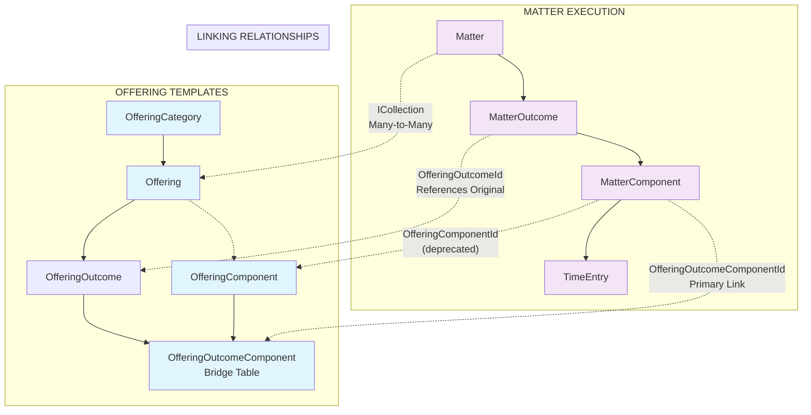
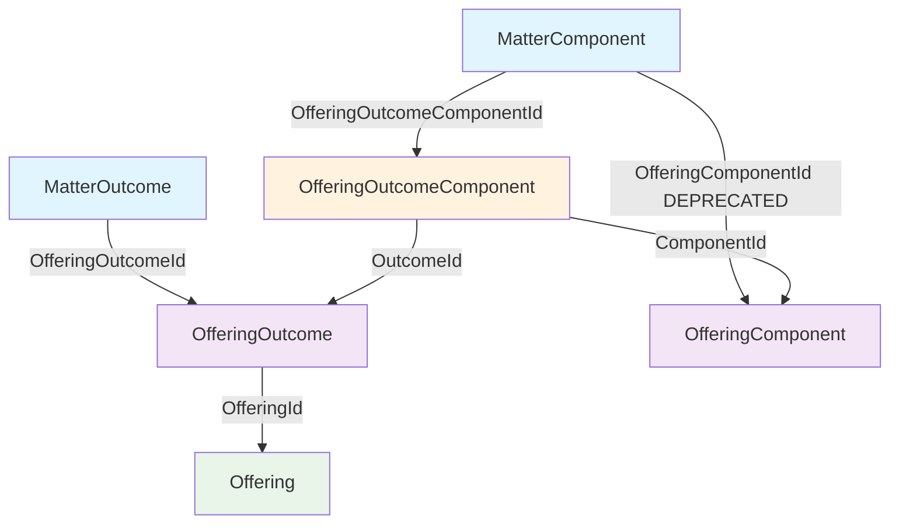

# ALP Offering Architecture
## Technical & Business Analysis

### Overview

Offerings in ALP represent a sophisticated **service delivery framework** that combines structured business templates with rich marketing content. This analysis synthesizes findings from both the business documentation (`ALP_Offerings_Service_Delivery.md`) and the actual codebase implementation in `ALP-reference/`.

---

## 🏗️ **System Architecture**

### **Hierarchical Structure**
```
📂 OfferingCategory
  └── 📋 Offering (Service Template)
      └── 🎯 OfferingOutcome (Deliverables)
          └── ⚙️ OfferingComponent (Tasks)
              └── 📎 OfferingComponentResource (Tools/Templates)
```

### **Copy-on-Create Pattern**
```
TEMPLATE LAYER                    EXECUTION LAYER
Offerings                    →    Matters
├── OfferingOutcomes        →    ├── MatterOutcomes
    ├── OfferingComponents  →        ├── MatterComponents
        └── Resources       →            └── TimeEntries
```

---

## 📊 **Data Model Analysis**

### **Core Entities** (from `ALP.Data.Models.Offerings/`)

#### **`OfferingCategory`**
```csharp
public class OfferingCategory : BaseEntity
{
    public string Name { get; set; }
    public bool Active { get; set; }
    public virtual IEnumerable<Offering> Offerings { get; set; }
}
```
- Simple categorization (e.g., "Corporate Law", "Property Law")
- Controls service portfolio organization
- Used for reporting and service mix analysis

#### **`Offering`** - The Core Template
```csharp
public class Offering : BaseEntity
{
    // Basic Info
    public int OfferingCategoryId { get; set; }
    public string Name { get; set; }
    public string Title { get; set; }
    
    // Marketing Framework Content (see below)
    // ...
    
    // Relationships
    public int? OfferingOwnerId { get; set; }
    public virtual User OfferingOwner { get; set; }
    public virtual ICollection<User> PermittedReviewers { get; set; }
    public virtual ICollection<User> SalesTeam { get; set; }
    public virtual IEnumerable<OfferingOutcome> Outcomes { get; set; }
    public virtual ICollection<Matter> Matters { get; set; }
}
```

#### **`OfferingOutcome`** - Service Deliverables
```csharp
public class OfferingOutcome : BaseEntity
{
    public int OfferingId { get; set; }
    public string Description { get; set; }
    public string Failure { get; set; }           // What constitutes failure
    public int Weight { get; set; }               // Relative importance
    public bool Active { get; set; }
    
    // Computed Properties
    [NotMapped]
    public int? TotalEstimatedUnits { get; set; }
    [NotMapped] 
    public int? TotalBudget { get; set; }
    
    public virtual ICollection<OfferingComponent> Components { get; set; }
}
```

#### **`OfferingComponent`** - Individual Tasks
```csharp
public class OfferingComponent : BaseEntity
{
    public string Title { get; set; }
    public string Description { get; set; }
    public int EstimatedUnits { get; set; }       // 6-minute increments
    public int Budget { get; set; }
    public int? LawSubAreaId { get; set; }
    public bool Active { get; set; }
    
    // Derived Property
    public LawArea LawArea => LawSubArea?.LawArea;
    
    public virtual ICollection<OfferingOutcome> Outcomes { get; set; }
    public virtual ICollection<OfferingComponentResource> Resources { get; set; }
}
```

#### **`OfferingOutcomeComponent`** - Many-to-Many Bridge
```csharp
public class OfferingOutcomeComponent : BaseEntity
{
    // Relationship IDs
    public int OutcomeId { get; set; }
    public int ComponentId { get; set; }
    public int Weight { get; set; }
    
    // Override Values (can customize per outcome)
    public string Title { get; set; }
    public string Description { get; set; }
    public int EstimatedUnits { get; set; }
    public int Budget { get; set; }
    public int? LawSubAreaId { get; set; }
    public bool Active { get; set; }
}
```

**Key Insight**: This bridge table allows the same component to be reused across multiple outcomes with different estimates/specifications.

---

## 🎯 **Marketing Framework Integration**

The `Offering` entity contains extensive marketing content structured around proven business frameworks:

### **Zippy Scooter Line** (Problem/Solution Framework)
```csharp
public string ZippyHeading { get; set; }          // Attention-grabbing headline
public string KeyProblem { get; set; }            // Core client pain point
public string Solution { get; set; }              // How firm addresses problem
```

### **Grunt Test** (Value Proposition Framework)
```csharp
public string GruntLine { get; set; }             // Elevator pitch
public string Situation { get; set; }             // Client circumstances  
public string WhatWeDo { get; set; }              // Service description
public string WhyBetter { get; set; }             // Competitive advantage
```

### **Quick Story** (Narrative Framework)
```csharp
public string QuickStoryHeading { get; set; }
public string StoryExternalProblem { get; set; }  // Observable challenge
public string StoryProblemIgnored { get; set; }   // Consequences of inaction
public string StoryProblemSolution { get; set; }  // Intervention approach
public string StoryProblemSolved { get; set; }    // Successful outcome
```

### **Character & Scenario Positioning**
```csharp
public string Character { get; set; }             // Ideal client persona
public string Scenario { get; set; }              // Typical situation
public string Salt { get; set; }                  // Pain point amplification
public string Villain { get; set; }               // What works against client
```

### **Call to Action & Authority**
```csharp
public string CallToActionHeading { get; set; }
public string CallToAction { get; set; }          // Next steps for clients
public string ExpressionsOfEmpathy { get; set; }  // Understanding statements
public string IndicatorsOfAuthority { get; set; } // Credibility markers
```

### **Step Plan & Process**
```csharp
public string StepPlanHeading { get; set; }
public string StepPlanTagLine1 { get; set; }
public string StepPlanTagLine2 { get; set; }
public string StepPlan { get; set; }              // Detailed implementation steps
public string ValuePoints { get; set; }           // JSON serialized value points
```

---

## ⚙️ **Service Layer Analysis**

### **Key Operations** (from `IOfferingService.cs`)

#### **CRUD Operations**
- Full offering lifecycle management
- Category management  
- Component and outcome management
- Resource attachment

#### **Advanced Features**
```csharp
// Template Management
Task DuplicateOffering(int id);
Task MergeOffering(int oldOfferingId, int newOfferingId);

// Component Reuse
Task AddOfferingComponentToOutcome(int offeringId, int outcomeId, int componentId);
Task MoveOfferingComponentIntoNewOutcome(int existingOutcomeComponentId, int destinationOutcomeId);

// User Management
Task AddPermittedReviewerToOffering(int offeringId, int userId);
Task AddPermittedSalesTeamToOffering(int offeringId, int userId);

// Matter Integration
Task<PaginatedDto<MatterListDto>> GetMattersForOffering(int offeringId, MatterFilterInput filters);
```

#### **⚠️ Operational Data Integrity Principles**

**Critical Finding**: The operations above have varying levels of matter data consistency. Understanding the correct principles is essential for maintaining data integrity:

##### **🎯 Core Principle: Historical Preservation**
- **Matter data represents historical state** when work was originally performed
- **Template changes should NOT retroactively alter matter content**
- **Only connector fields should be updated** to maintain analytics links

##### **🔄 Operation Categories**

**Move Operations** (Same entities, new locations):
- **Move Component**: `OfferingOutcomeComponent.OutcomeId` changes → **No matter updates needed**
- **Move Outcome**: `OfferingOutcome.OfferingId` changes → **No matter updates needed**
- **Principle**: Same IDs, analytics follow automatically

**Merge Operations** (Consolidate entities):
- **Merge Component**: Old deleted → **Update connector fields only** (`OfferingOutcomeComponentId`)  
- **Merge Outcome**: Old deleted → **Update connector fields only** (`OfferingOutcomeId`)
- **Principle**: Links updated, content preserved

##### **🚨 Critical Bug Alert**
- **`MoveOfferingOutcomeIntoOffering`** has data corruption bug
- **Issue**: Sets `MatterOutcome.OfferingOutcomeId` to offering ID (wrong type!)
- **Impact**: Breaks analytics, corrupts foreign key relationships
- **Status**: Requires immediate fix (P0 priority)

##### **✅ Correctly Implemented Operations**
- **Merge operations**: Properly update connectors while preserving content
- **Move component**: Correctly performs no matter updates
- **Add/Remove component**: Proper dependency checking and data copying

#### **Data Transfer Objects Structure**

**`OfferingDto`** includes:
- All marketing framework fields
- Related entities (category, owner, reviewers, sales team)
- Special handling for `ValuePoints` and `StepPlan` (JSON serialized)

**`OfferingComponentDto`** includes:
- Estimation data (`EstimatedUnits`, `Budget`)
- Legal classification (`LawSubAreaId`, derived `LawArea`)
- Status tracking (`Active`)

---

## 🔄 **AutoMapper Configuration Analysis**

From `OfferingProfile.cs`:

### **Key Mappings**
```csharp
// Core offering mappings with special handling
CreateMap<Offering, OfferingDto>()
    .ForMember(dest => dest.ValuePoints, dest => dest.Ignore())
    .ForMember(dest => dest.StepPlan, dest => dest.Ignore())
    .ReverseMap();

// Component to matter component conversion
CreateMap<OfferingComponentInput, MatterComponent>();

// Outcome-component bridge handling
CreateMap<OfferingComponentInput, OfferingOutcomeComponent>();
```

**Key Insight**: `ValuePoints` and `StepPlan` require special handling, likely JSON serialization/deserialization.

---

## 📈 **Business Intelligence Capabilities**

### **Template Performance Analysis**
- **Estimation Accuracy**: Compare `EstimatedUnits` vs actual time entries
- **Cost Variance**: Track `Budget` vs actual costs  
- **Component Reuse**: Identify highly reusable components across offerings
- **Success Rate Tracking**: Monitor outcome delivery success rates

### **Service Portfolio Analysis**  
- **Category Performance**: Service mix and profitability by category
- **Template Evolution**: Track offering changes over time
- **Resource Utilization**: SharePoint integration and resource usage
- **Client Satisfaction**: Link service delivery to satisfaction scores

### **Operational Insights**
- **Capacity Planning**: Forecast needs based on offering mix
- **Pricing Validation**: Validate pricing models against delivery costs
- **Cross-Selling**: Identify complementary service patterns
- **Quality Control**: Monitor failure rates and common issues

---

## 🔗 **Integration Points**

### **Matter Management**
- **Copy-on-create pattern**: Matter instantiation preserves template state at creation time
- **Bidirectional tracking**: Offerings → matters, matters → offerings through connector fields
- **Historical stability**: Template structure changes don't affect existing matter content
- **Operational integrity**: Move operations require no matter updates, merge operations update connectors only

### **Time Tracking**
- Time entries recorded against matter components  
- Component estimates drive capacity planning
- Variance analysis for template optimization

### **SharePoint Integration**
```csharp
public string? SharePointFolder { get; set; }
```
- Document templates and resources
- Service delivery tools and references

### **User Management**
- Offering ownership and responsibility
- Review/approval workflows
- Sales team assignments

---

## ⚠️ **Technical Considerations**

### **Performance Implications**
- Complex joins across offering → matter → time entry relationships
- Large datasets require careful indexing and date filtering
- Component-level aggregations can be expensive

### **Data Integrity**
- **Copy-on-create pattern**: Ensures historical stability at matter creation
- **Soft deletion pattern**: `IsDeleted` from `BaseEntity` for audit trails
- **Connector field principle**: Only links updated during template operations, content preserved
- **Critical vulnerability**: Move outcome operation corrupts `MatterOutcome.OfferingOutcomeId` (P0 bug)
- **Template versioning challenges**: Historical analysis complicated by structural changes

### **Business Logic Complexity**
- Many-to-many relationships require careful management
- Component reuse across outcomes adds complexity
- Template customization vs standardization balance

---

## 💡 **Key Insights**

1. **Rich Content Strategy**: Offerings are more than task lists—they're complete marketing and delivery frameworks

2. **Template Flexibility**: The bridge table pattern allows sophisticated component reuse while maintaining customization

3. **Copy-on-Create Wisdom**: Ensures template evolution doesn't break existing client work

4. **Business Intelligence Foundation**: The structure enables sophisticated analytics on service delivery performance

5. **Marketing Integration**: Business development frameworks are built into the core data model

6. **Resource Management**: SharePoint integration provides document template infrastructure

---

## 🎯 **Strategic Value**

The offering architecture enables ALP to:
- **Standardize service delivery** while maintaining flexibility
- **Track template performance** and continuously improve estimates
- **Scale expertise** through reusable components and frameworks  
- **Integrate marketing and delivery** in a single coherent system
- **Measure business outcomes** with granular analytics
- **Support rapid client engagement** with pre-built marketing content

This represents a sophisticated approach to legal service delivery that goes far beyond traditional time tracking, providing a foundation for systematic business growth and service excellence.

---

## 🔄 **Offering-to-Matter Relationship Architecture**

### **Overview: Template-to-Reality Implementation**

When legal work begins, ALP uses a sophisticated **copy-on-create pattern** to instantiate offering templates into executable matter structures. This process preserves template integrity while enabling matter-specific customization and maintaining full analytical traceability.

### **Relationship Diagram**



---

## 📊 **Matter Entity Analysis**

### **`Matter.cs` - Core Matter Structure**

```csharp
public class Matter : BaseEntity
{
    // Basic matter identification
    public string Name { get; set; }
    public string Description { get; set; }
    public int ClientId { get; set; }
    public decimal EstimatedBudget { get; set; }
    
    // Status and workflow
    public MatterStatus Status { get; set; }  // ToBeQuoted, Open, Closed, etc.
    public DateTime FirstContactDate { get; set; }
    public DateTime? ClosedDate { get; set; }
    public DateTime? EstimatedClosingDate { get; set; }
    
    // 🔗 KEY OFFERING RELATIONSHIPS
    public int? OfferingCategoryId { get; set; }
    public virtual OfferingCategory OfferingCategory { get; set; }
    public virtual ICollection<Offering> Offerings { get; set; }  // Many-to-Many
    
    // Matter execution structure
    public virtual ICollection<MatterOutcome> Outcomes { get; set; }
    
    // Team and responsibility
    public int ReviewerId { get; set; }
    public int? CoordinatorId { get; set; }
    public virtual ICollection<User> Team { get; set; }
    
    // Business classification
    public int? SegmentId { get; set; }
    public int? SubSegmentId { get; set; }
    public virtual Segment Segment { get; set; }
    public virtual SubSegment SubSegment { get; set; }
}
```

**Critical Insight**: A **single matter can be associated with multiple offerings** through the `ICollection<Offering>` relationship, enabling complex service delivery combinations.

### **`MatterOutcome.cs` - Deliverable Tracking**

```csharp
public class MatterOutcome : BaseEntity
{
    // 🔗 CRITICAL TRACEABILITY LINK
    public int? OfferingOutcomeId { get; set; }
    public virtual OfferingOutcome OfferingOutcome { get; set; }
    
    // Matter association
    public int MatterId { get; set; }
    public virtual Matter Matter { get; set; }
    
    // Copied content (customizable per matter)
    public string Description { get; set; }
    public string Failure { get; set; }
    public int Weight { get; set; }
    
    // Component execution
    public virtual ICollection<MatterComponent> Components { get; set; }
}
```

**Key Mechanism**: `OfferingOutcomeId` provides **direct traceability** from executed outcomes back to their template origins, enabling performance analysis and template optimization.

### **`MatterComponent.cs` - Task Execution Tracking**

```csharp
public class MatterComponent : BaseEntity
{
    // 🔗 DUAL LINKING STRATEGY FOR FLEXIBILITY
    public int? OfferingComponentId { get; set; }           // Direct link (deprecated)
    public int? OfferingOutcomeComponentId { get; set; }    // Bridge table link (preferred)
    
    public virtual OfferingComponent OfferingComponent { get; set; }
    public virtual OfferingOutcomeComponent OfferingOutcomeComponent { get; set; }
    
    // Matter structure
    public int MatterOutcomeId { get; set; }
    public virtual MatterOutcome MatterOutcome { get; set; }
    
    // Copied/customized task definition
    public string Title { get; set; }
    public string Description { get; set; }
    public int EstimatedUnits { get; set; }        // 6-minute increments
    public int Budget { get; set; }
    public int Weight { get; set; }
    public int? LawSubAreaId { get; set; }
    
    // Execution tracking
    public DateTime? DueDate { get; set; }
    public bool Complete { get; set; }
    public int? TotalUnits => TimeEntries?.Sum(t => t.Units);  // Computed actual time
    
    // Actual work performed
    public ICollection<MatterComponentTimeEntry> TimeEntries { get; set; }
    public virtual ICollection<User> Assigned { get; set; }
}
```

**Linking Architecture**: 
- **`OfferingOutcomeComponentId`** - **Primary link** to the bridge table (modern approach)
- **`OfferingComponentId`** - **Direct component link** (deprecated but preserved for backward compatibility)

---

## 🔄 **Copy-on-Create Process Flow**

### **1. Template Selection Phase**
```
User Creates New Matter
├── Selects Client & Basic Info
├── Chooses Relevant Offering(s) → Many-to-Many Association
├── Selects Specific OfferingOutcomes → Determines Scope
└── Selects OfferingComponents → Via OfferingOutcomeComponents
```

### **2. Data Copying Process**

#### **Step 1: MatterOutcome Creation**
```sql
INSERT INTO matter_outcomes (
    offering_outcome_id,    -- 🔗 PRESERVED LINK for analytics
    matter_id,
    description,           -- COPIED from offering_outcome.description
    failure,              -- COPIED from offering_outcome.failure
    weight,               -- COPIED from offering_outcome.weight
    inserted_at,
    updated_at
)
```

#### **Step 2: MatterComponent Creation** 
```sql
INSERT INTO matter_components (
    offering_outcome_component_id,  -- 🔗 PRIMARY LINK (preferred)
    offering_component_id,          -- 🔗 SECONDARY LINK (deprecated)
    matter_outcome_id,
    title,                         -- COPIED from offering_outcome_component.title
    description,                   -- COPIED from offering_outcome_component.description
    estimated_units,               -- COPIED from offering_outcome_component.estimated_units
    budget,                        -- COPIED from offering_outcome_component.budget
    weight,                        -- COPIED from offering_outcome_component.weight
    law_sub_area_id,              -- COPIED from offering_outcome_component.law_sub_area_id
    inserted_at,
    updated_at
)
```

### **3. Post-Copy Customization**
- **Values can be modified** for matter-specific requirements
- **Original template links preserved** for analytics
- **Templates remain unchanged** (historical stability)
- **Independent evolution** of matter vs. template

---

## 📈 **Analytical Capabilities**

### **Template Performance Analysis**

#### **Estimation Accuracy Tracking**
```sql
-- Compare template estimates vs actual performance
SELECT 
    o.name as offering_name,
    oc.title as component_name,
    ooc.estimated_units as template_estimate,
    AVG(mc.total_units) as actual_average,
    COUNT(mc.id) as usage_count,
    ROUND(
        (AVG(mc.total_units) - ooc.estimated_units) * 100.0 / ooc.estimated_units, 2
    ) as variance_percentage
FROM offerings o
JOIN offering_outcomes oo ON o.id = oo.offering_id
JOIN offering_outcome_components ooc ON oo.id = ooc.outcome_id
JOIN matter_components mc ON ooc.id = mc.offering_outcome_component_id  -- 🔗 LINK USED
WHERE mc.total_units IS NOT NULL
GROUP BY o.id, o.name, oc.id, oc.title, ooc.estimated_units
HAVING COUNT(mc.id) >= 3  -- Sufficient sample size
ORDER BY ABS(variance_percentage) DESC;
```

#### **Outcome Success Rate Analysis**
```sql
-- Track deliverable success rates by template
SELECT 
    o.name as offering_name,
    oo.description as outcome_description,
    COUNT(mo.id) as total_attempts,
    SUM(CASE WHEN mo.complete = true THEN 1 ELSE 0 END) as successful_deliveries,
    ROUND(
        (SUM(CASE WHEN mo.complete = true THEN 1 ELSE 0 END) * 100.0) / COUNT(mo.id), 2
    ) as success_rate_percent
FROM offerings o
JOIN offering_outcomes oo ON o.id = oo.offering_id
JOIN matter_outcomes mo ON oo.id = mo.offering_outcome_id  -- 🔗 LINK USED
WHERE mo.is_deleted = false
GROUP BY o.id, o.name, oo.id, oo.description
HAVING COUNT(mo.id) >= 5  -- Minimum sample size
ORDER BY success_rate_percent ASC;  -- Problem areas first
```

### **Component Reuse Analysis**
```sql
-- Identify most valuable reusable components
SELECT 
    oc.title as component_name,
    COUNT(DISTINCT o.id) as offering_count,
    COUNT(DISTINCT mc.id) as matter_usage_count,
    AVG(mc.total_units / 10.0) as avg_hours_per_use,
    AVG(oc.estimated_units / 10.0) as estimated_hours,
    ROUND(
        AVG((mc.total_units - oc.estimated_units) * 100.0 / oc.estimated_units), 1
    ) as avg_variance_percent
FROM offering_components oc
JOIN offering_outcome_components ooc ON oc.id = ooc.component_id
JOIN offerings o ON ooc.outcome_id IN (
    SELECT id FROM offering_outcomes WHERE offering_id = o.id
)
JOIN matter_components mc ON ooc.id = mc.offering_outcome_component_id  -- 🔗 BRIDGE LINK
WHERE mc.total_units IS NOT NULL
GROUP BY oc.id, oc.title, oc.estimated_units
HAVING COUNT(DISTINCT o.id) > 1  -- Used across multiple offerings
ORDER BY matter_usage_count DESC;
```

### **Cross-Offering Matter Analysis**
```sql
-- Analyze matters using multiple offerings
SELECT 
    m.name as matter_name,
    m.client_id,
    COUNT(DISTINCT o.id) as offering_count,
    STRING_AGG(o.name, ', ') as offering_names,
    SUM(m.estimated_budget) as total_estimated_budget,
    COUNT(DISTINCT mo.id) as outcome_count,
    COUNT(DISTINCT mc.id) as component_count
FROM matters m
JOIN matter_offerings mo_link ON m.id = mo_link.matter_id  -- Many-to-many join table
JOIN offerings o ON mo_link.offering_id = o.id
LEFT JOIN matter_outcomes mo ON m.id = mo.matter_id
LEFT JOIN matter_components mc ON mo.id = mc.matter_outcome_id
WHERE m.is_deleted = false
GROUP BY m.id, m.name, m.client_id, m.estimated_budget
HAVING COUNT(DISTINCT o.id) > 1  -- Multiple offerings
ORDER BY offering_count DESC, component_count DESC;
```

---

## 🔗 **Integration & Workflow Patterns**

### **Matter Creation Workflow**
1. **Offering Selection** → User selects relevant offerings
2. **Scope Definition** → User chooses outcomes and components
3. **Template Instantiation** → Copy-on-create process executes
4. **Customization** → Matter-specific adjustments made
5. **Execution Tracking** → Time entries recorded against components
6. **Progress Monitoring** → Component completion and outcome delivery
7. **Performance Analysis** → Compare actual vs. template estimates

### **Data Integrity Patterns**
- **Soft Deletion**: All entities use `IsDeleted` flag
- **Audit Trail**: `InsertedAt`, `UpdatedAt`, `InsertedBy`, `LastUpdatedBy`
- **Historical Stability**: Template changes don't affect existing matters
- **Referential Integrity**: Foreign key relationships maintained

### **Business Intelligence Integration**
- **Template Evolution**: Track offering improvements over time
- **Resource Planning**: Forecast capacity based on component estimates
- **Client Value**: Link service delivery success to client satisfaction
- **Pricing Optimization**: Validate pricing models against actual costs

---

## 💡 **Advanced Insights**

### **Connector Fields Evolution & Architecture**

The ALP system uses three critical connector fields that represent the evolution of how matter data links back to offering templates. Understanding these fields is essential for analytics, reporting, and system maintenance.

#### **🔗 The Three Connector Fields**

##### **1. `OfferingOutcomeId` (in MatterOutcome)**

**🎯 Purpose**: Links matter outcomes back to their original offering outcome template

**📍 Location**: `MatterOutcome.OfferingOutcomeId` → `OfferingOutcome.Id`

**💡 Role**:
- **Template Traceability**: "This matter outcome was created from offering outcome #123"
- **Analytics Foundation**: Enables comparison of planned vs actual outcomes
- **Performance Tracking**: Measures how well offering outcomes perform in real matters
- **Navigation**: Allows drilling from matter results back to template definitions

**📊 Analytics Use**: 
- "How often do matters achieve the outcomes we promised in the offering?"
- "Which offering outcomes are most/least successful?"

##### **2. `OfferingComponentId` (in MatterComponent) - DEPRECATED**

**🎯 Purpose**: ⚠️ **Legacy field** - old way to link matter components to offering components

**📍 Location**: `MatterComponent.OfferingComponentId` → `OfferingComponent.Id`
**⚠️ Status**: **Deprecated** (being phased out)

**💡 Original Role**:
- Direct link from matter component to base offering component
- Simple 1:1 relationship model

**❌ Why Deprecated**:
- **Too Rigid**: Couldn't handle components used in multiple outcomes
- **Limited Flexibility**: No way to track which outcome context the component was used in
- **Analytics Gaps**: Couldn't analyze component performance within specific outcome contexts

##### **3. `OfferingOutcomeComponentId` (in MatterComponent) - CURRENT**

**🎯 Purpose**: **Primary connector** - links matter components to the bridge table entry

**📍 Location**: `MatterComponent.OfferingOutcomeComponentId` → `OfferingOutcomeComponent.Id`
**✅ Status**: **Active and Preferred**

**💡 Current Role**:
- **Context-Aware Linking**: "This matter component came from component X used in outcome Y context"
- **Flexible Reuse**: Same base component can be used in multiple outcomes with different configurations
- **Rich Analytics**: Tracks component performance within specific outcome contexts
- **Template Evolution**: Supports sophisticated offering template management

**🌉 Bridge Table Benefits**:
The `OfferingOutcomeComponent` bridge table allows:
- Same component in multiple outcomes with different settings
- Outcome-specific component configurations (different estimates, descriptions)
- Complex offering template structures

#### **📊 Analytics Flow Through Connectors**



**Legend**:
- 🔵 **Blue**: Matter entities (execution layer)
- 🟠 **Orange**: Bridge table (relationship layer)
- 🟣 **Purple**: Template entities (design layer)
- 🟢 **Green**: Top-level offering

#### **🔄 Evolution Example**

**Old Approach (OfferingComponentId)**:
```
MatterComponent → OfferingComponent
❌ Problem: Can't tell which outcome context this was used in
```

**New Approach (OfferingOutcomeComponentId)**:
```
MatterComponent → OfferingOutcomeComponent → OfferingComponent
                                        ↘ OfferingOutcome
✅ Solution: Full context preserved - component X in outcome Y
```

#### **📈 Analytics Capabilities by Field**

| **Field** | **Analytics Enabled** |
|-----------|----------------------|
| `OfferingOutcomeId` | Outcome success rates, delivery accuracy, outcome performance |
| `OfferingComponentId` | Basic component usage (being phased out) |
| `OfferingOutcomeComponentId` | Component performance in context, outcome-component effectiveness, template optimization |

#### **🎯 Key Architectural Insight**

The evolution from `OfferingComponentId` to `OfferingOutcomeComponentId` reflects ALP's sophisticated understanding that **context matters** in legal service delivery. A "Document Review" component performs differently when used in a "Due Diligence" outcome versus a "Compliance Audit" outcome, and the system now tracks these contextual differences for better analytics and template refinement.

### **Copy-on-Create Advantages**
1. **Template Stability**: Changes don't break existing matters
2. **Matter Customization**: Specific adjustments without affecting templates
3. **Historical Analysis**: Consistent data for longitudinal studies
4. **Independent Evolution**: Templates and matters can evolve separately

### **Many-to-Many Matter-Offering Benefits**
1. **Complex Service Delivery**: Matters can combine multiple service types
2. **Cross-Selling Analysis**: Identify successful offering combinations
3. **Resource Optimization**: Understand multi-offering execution patterns
4. **Client Sophistication**: Handle complex legal requirements

---

## ⚠️ **Technical Considerations**

### **Performance Optimization**
- **Complex Joins**: Matter → Outcome → Component → TimeEntry chains require indexing
- **Aggregation Queries**: Component totals and outcome summaries need caching
- **Historical Data**: Date filtering essential for large datasets
- **Bridge Table Queries**: OfferingOutcomeComponent joins can be expensive

### **Data Migration Challenges**
- **Dual Links**: Both `OfferingComponentId` and `OfferingOutcomeComponentId` must be handled
- **Template Versioning**: Historical matters may reference outdated template structures
- **Many-to-Many Complexity**: Matter-offering associations require careful migration
- **Soft Deletion**: Ensure proper handling of deleted but referenced entities

### **Business Logic Complexity**
- **Component Reuse**: Same component in multiple outcomes requires careful handling
- **Estimation Propagation**: Changes to component estimates affect multiple layers
- **Status Synchronization**: Component completion affects outcome and matter status
- **Permission Management**: Access control across offering and matter hierarchies

---

**Analysis Date**: December 2024  
**Sources**: 
- `ALP_Offerings_Service_Delivery.md` (Business Documentation)
- `ALP-reference/ALP.Data.Models.Offerings/` (Entity Models)
- `ALP-reference/ALP.Services.Offerings/` (Service Layer)
- `ALP-reference/ALP.Services.Offerings.Mapping/` (Data Transfer Configuration)