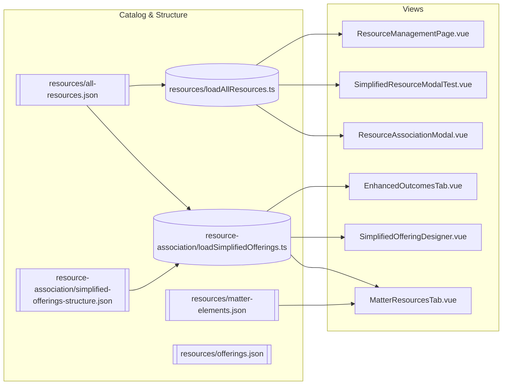
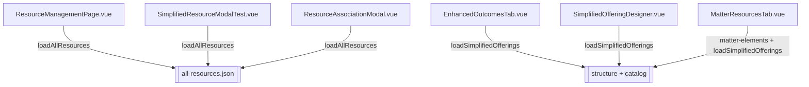

# ALP Data Fixtures

This folder contains unified JSON fixtures and small loaders used by the prototype.

## Resources Catalog
- `resources/all-resources.json`: Single catalog for all resource objects used across the prototype.
- `resources/loadAllResources.ts`: Loader that returns the catalog (lazy import).

## Offerings Structure and Associations
- `resource-association/simplified-offerings-structure.json`: Offerings → outcomes → components with `associatedResourceIds`.
- `resource-association/loadSimplifiedOfferings.ts`: Resolves the structure to the same shape used by views by mapping `associatedResourceIds` to full resource objects from the catalog.

## Matters and Offering Metadata
- `resources/matter-elements.json`: Matter outcomes/components with `linkedOfferingElementId` that points to the current structure ID (e.g., `outcome-1`, `component-1`).
- `resources/offerings.json`: Optional offering metadata (e.g., `vdFolderUrl`), not currently used by the active views.

## Conventions
- Keep the catalog (`all-resources.json`) as the single source of truth for resources.
- Structure files should reference resources by `id` only; resolution happens in loaders.
- `linkedOfferingElementId` should store the actual structure ID so no mapping is needed in the UI.

## Removed Legacy/Sample Files
The following have been removed in favor of the unified approach:
- `resources/offering-resources.json` → replaced by structure + catalog resolution
- `resource-association/simplified-offerings.json` → replaced by `simplified-offerings-structure.json`
- `resources/sample-resources.json`, `resources/loadSampleResources.ts` → replaced by `all-resources.json` + `loadAllResources.ts`

## Data flow diagram

Legend:
- LAR resolves the unified catalog for flat resource lists.
- LSO resolves `associatedResourceIds` in the structure to full resource objects from the catalog.
- MRT builds a hierarchy by joining `matter-elements.json` (linkedOfferingElementId) to resolved structure nodes.

## Component to data mapping

Notes:
- `linkedOfferingElementId` in matter elements stores the actual structure ID (e.g., `outcome-1`, `component-1`).
- `simplified-offerings-structure.json` is the single place where associations live (`associatedResourceIds`).
- Views never duplicate resources; they resolve via loaders.
