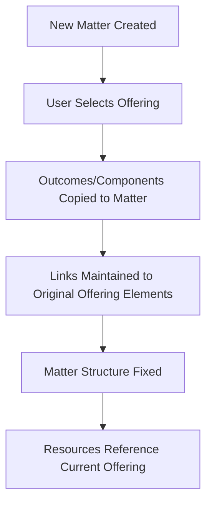

# Data Linking Architecture - Offering-Matter Resource Relationships

## Overview

The Portal Resources system must handle a complex data relationship between Offerings, Matters, and Resources. This document details the linking architecture and its implications for the prototype.

## Core Architecture Principles

### 1. Offering-Matter Separation
- **Offerings**: Master templates defining legal service structures
- **Matters**: Specific client engagements based on offerings
- **Separation**: Offerings can evolve independently of active matters

### 2. Matter Creation Process



#### Step-by-Step Process:
1. **Matter Setup**: User creates new matter and selects relevant offering (e.g., Offering O1)
2. **Structure Copy**: Offering outcomes/components are **copied** to matter:
   - Offering O1 has Outcome OA, Component OZ  
   - Matter M1 gets copies: Outcome MA, Component MZ
3. **Link Creation**: Each copied element maintains link to current offering element:
   - Matter Outcome MA → links to → Offering Outcome OA
   - Matter Component MZ → links to → Offering Component OZ
4. **Resource Reference**: Matter elements fetch resources from their linked offering elements

### 3. Offering Evolution Impact

#### Example: Offering Redesign During Active Matter

**Initial State:**
- Offering O1: Outcome OA, Component OZ (with Resources R1, R2)
- Matter M1: Outcome MA → linked to → Outcome OA, Component MZ → linked to → Component OZ

**Offering Redesign:**
- Component OZ merged with Component OH to create Component OH-merged
- Background process updates Matter Component MZ link: OZ → OH-merged

**Result for Matter M1:**
- Matter structure unchanged: still has Outcome MA, Component MZ (same names, same UI)
- Resource display updated: Component MZ now shows resources from OH-merged
- User sees: same matter structure, potentially different resources

**Deletion Scenario:**
- If Component OZ deleted in offering redesign
- Matter Component MZ link becomes inactive
- Component MZ displays with no resources (empty state)

## Data Structures

### Core Entities

```typescript
interface OfferingElement {
  id: string
  offeringId: string
  type: 'outcome' | 'component'
  name: string
  parentId?: string
  sequence: number
  version: number  // Incremented when offering redesigned
}

interface MatterElement {
  id: string
  matterId: string
  type: 'outcome' | 'component'
  name: string            // Copied from offering at matter creation
  parentId?: string
  sequence: number
  sourceOfferingElementId: string  // Original offering element ID
  createdAt: string       // When copied to matter
}

interface OfferingMatterLink {
  id: string
  matterElementId: string
  originalOfferingElementId: string
  currentOfferingElementId: string  // May change if offering redesigned
  linkType: 'direct' | 'merged' | 'split' | 'deleted'
  confidence: number      // Analytics confidence in link accuracy
  lastUpdated: string
}

interface Resource {
  id: string
  name: string
  type: ResourceType
  // ... other properties
}

interface ResourceAssociation {
  id: string
  resourceId: string
  offeringElementId: string  // Always references CURRENT offering structure
  associationType: 'primary' | 'secondary' | 'optional'
  sequence: number
}
```

### Simplified Data Layer Logic

**Key Principle**: Matter elements always fetch resources from their current linked offering element.

```typescript
// Simplified approach - data layer handles the complexity
const getResourcesForMatterElement = async (matterElementId: string): Promise<Resource[]> => {
  // 1. Matter element has a link ID to current offering element
  const matterElement = await getMatterElement(matterElementId)
  const currentOfferingElementId = matterElement.linkedOfferingElementId
  
  // 2. Fetch resources for current offering element
  // This automatically reflects any offering redesign changes
  return await getResourcesForOfferingElement(currentOfferingElementId)
}
```

**Background Process**: When offerings are redesigned:
- Component OZ merged with Component OH → Matter Component MZ link updated to point to OH
- Component OZ deleted → Matter Component MZ link becomes null/inactive
- Matter UI automatically reflects these changes on next resource fetch
```

## Prototype Implementation Strategy

### 1. Test Data Design

Create test data that simulates the linking relationships:

```json
// matter-offering-links.json
[
  {
    "id": "link-001",
    "matterElementId": "matter-component-001",
    "originalOfferingElementId": "offering-component-original-001",
    "currentOfferingElementId": "offering-component-current-001",
    "linkType": "direct",
    "confidence": 1.0,
    "lastUpdated": "2024-01-15T00:00:00Z"
  },
  {
    "id": "link-002", 
    "matterElementId": "matter-component-002",
    "originalOfferingElementId": "offering-component-original-002",
    "currentOfferingElementId": "offering-component-merged-003",
    "linkType": "merged",
    "confidence": 0.9,
    "lastUpdated": "2024-01-20T00:00:00Z"
  }
]
```

### 2. Resource Loading Implementation

```typescript
// Composable for matter resource loading
export const useMatterResources = (matterId: string) => {
  const loadMatterResources = async () => {
    // 1. Load matter elements
    const matterElements = await loadMatterElements(matterId)
    
    // 2. Load offering-matter links
    const links = await loadOfferingMatterLinks(matterId)
    
    // 3. Load current offering resources
    const currentOfferingElementIds = links.map(l => l.currentOfferingElementId)
    const resourceAssociations = await loadResourceAssociations(currentOfferingElementIds)
    
    // 4. Build hierarchical resource structure
    return buildResourceHierarchy(matterElements, links, resourceAssociations)
  }
  
  return { loadMatterResources }
}
```

### 3. User Experience Considerations

#### Dynamic Resource Updates
- **Positive**: Users always see current, up-to-date resources
- **Negative**: Resources may disappear unexpectedly during matter lifecycle
- **Mitigation**: Clear messaging when offering has been updated

#### Resource Versioning Display
```vue
<!-- Resource card with offering version info -->
<ResourceCard>
  <template #header>
    <ResourceTitle>{{ resource.name }}</ResourceTitle>
    <Badge v-if="isOfferingUpdated" variant="info">
      Updated in offering
    </Badge>
  </template>
  
  <template #footer>
    <p v-if="linkConfidence < 1.0" class="text-xs text-amber-600">
      ⚠️ Offering structure has changed - resource link may have shifted
    </p>
  </template>
</ResourceCard>
```

## Analytics Implications

### Tracking Resource Usage
- **Challenge**: Resource associations can change due to offering redesign
- **Solution**: Track both original and current offering element IDs
- **Benefit**: Analytics can account for offering evolution impact

### Link Confidence Scoring
- **Direct Link**: confidence = 1.0 (no offering changes)
- **Merged Elements**: confidence = 0.8-0.9 (elements combined)
- **Split Elements**: confidence = 0.6-0.8 (elements divided)
- **Deleted Elements**: confidence = 0.0-0.5 (elements removed)

## Future Considerations

### Potential Enhancements
1. **Resource Versioning**: Track when resources are accessed before/after offering changes
2. **Change Notifications**: Alert users when offering updates affect their matters
3. **Manual Link Updates**: Allow users to manually update resource links if automatic resolution fails
4. **Resource History**: Maintain history of resource associations for audit purposes

## References

- **Detailed Architecture**: `/alp-documentation/alp_offering_architecture.md`
- **Analytics Patterns**: `/alp-documentation/alp_analytics_offering_matters.md`
- **Database Schema**: `/alp-documentation/alp_database_structure.sql`

---

This linking architecture ensures that the Portal Resources system correctly handles the complex relationship between evolving offerings and static matter structures while maintaining resource currency and analytics capability.